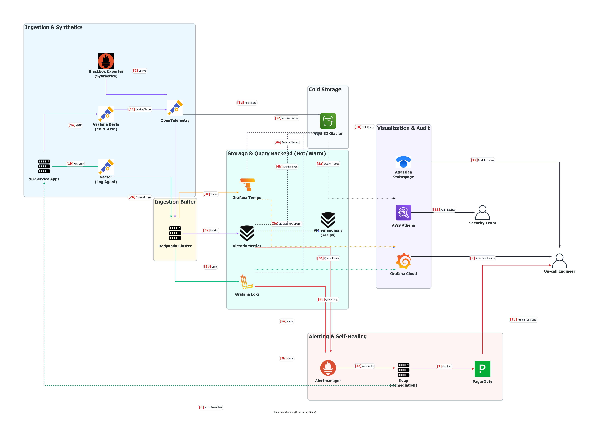

# A1: Target-State Architecture Diagram

This document presents the target-state architecture for the observability stack, focusing on achieving a "Single Pane of Glass" via Grafana and dramatically reducing storage costs by using S3-backed OSS databases.

## Operational Data Flow (Luồng hoạt động)

Dưới đây là chú thích chi tiết cho các luồng dữ liệu được đánh số trên sơ đồ:

### 1. Data Collection (Thu thập dữ liệu)
- **[1a] eBPF Telemetry**: Grafana Beyla chạy ở tầng nhân (Kernel) tự động thu thập HTTP/gRPC metrics và distributed tracing từ các ứng dụng không cần sửa code và đẩy qua OTel Collector.
- **[1b] Log Ingestion**: Vector Agent thu thập log ứng dụng và hệ thống, thực hiện định dạng và gán nhãn thô trước khi chuyển tiếp.
- **[1c] Uptime Metrics**: Hệ thống Blackbox Exporter liên tục "ping" kiểm tra sức khỏe của các điểm neo (endpoints) và gửi số liệu Uptime về hệ thống.

### 2. Ingestion & Routing & Buffering (Điều phối & Bộ đệm)
- **[2] Redpanda Buffer**: Toàn bộ luồng dữ liệu logs, metrics và traces đi qua **Redpanda Cluster** làm bộ đệm trung gian chịu tải cao. Điều này bảo vệ các storage backend (Loki, VictoriaMetrics, Tempo) khỏi bị log storm/DDoS đánh sập và tránh mất dữ liệu khi storage nodes bảo trì.
- **[3a] Metrics**: Redpanda ghi metrics ổn định vào VictoriaMetrics.
- **[3b] Logs**: Redpanda ghi logs vào Grafana Loki.
- **[3c] Traces**: Redpanda ghi traces vào Grafana Tempo.
- **[3d] Audit Logs**: Logs kiểm toán đi thẳng từ OTel Collector sang AWS S3 Glacier phục vụ lưu trữ lâu dài.
- **[3e] Anomaly Detection (AIOps)**: VictoriaMetrics `vmanomaly` kéo số liệu lịch sử từ VictoriaMetrics, tính toán các điểm bất thường bằng mô hình ML và đẩy ngược kết quả về VictoriaMetrics làm time-series mới.

### 3. Archiving (Lưu trữ lạnh)
- **[4a, 4b, 4c] Blocks/Chunks**: Thay vì lưu trữ vĩnh viễn trên đĩa cứng đắt đỏ, VictoriaMetrics, Loki và Tempo được cấu hình để định kỳ nén dữ liệu cũ thành các khối (Blocks/Chunks) và đẩy xuống kho lạnh S3. 

### 4. Alerting & Auto-Remediation (Cảnh báo & Tự sửa lỗi)
- **[5a, 5b] Alerts**: Khi có bất thường (CPU cao, Anomaly Score > 1.0, hoặc Loki alert), các luật cảnh báo kích hoạt và gửi tín hiệu Alert về Alertmanager.
- **[5c] Self-Healing webhook**: Alertmanager gửi webhook cảnh báo đến **Keep (Remediation Engine)**.
- **[6] Auto-Remediation**: Keep tự động chạy các playbooks khắc phục sự cố (ví dụ: giải phóng dung lượng đĩa, reboot service, scale-out pod).
- **[7] Escalation**: Nếu Keep tự sửa lỗi thất bại hoặc đối với các lỗi nghiêm trọng cấp độ High/Critical, Keep sẽ kích hoạt PagerDuty để réo gọi kỹ sư On-call trực ca.

### 5. UI & Human Interaction (Tương tác con người)
- **[8a, 8b, 8c] Query**: Khi nhận được cảnh báo, Kỹ sư mở Grafana lên. Grafana sẽ truy vấn ngược lại VictoriaMetrics, Loki, Tempo để lấy dữ liệu vẽ biểu đồ. Grafana Machine Learning cũng đồng thời cung cấp dải dự báo động (adaptive thresholds) trực quan trên dashboard.
- **[9] Dashboards**: Kỹ sư On-call theo dõi diễn biến sự cố qua "Single Pane of Glass" (Màn hình duy nhất) trên Grafana Cloud.
- **[10, 11] SQL Audit**: Đối với đội Bảo mật (Security Team), họ có thể dùng AWS Athena để truy vấn trực tiếp kho Audit Logs lưu trên S3 bằng lệnh SQL tiêu chuẩn để rà soát lỗ hổng.
- **[12] Update Status**: Cuối cùng, kỹ sư chủ động cập nhật tình trạng khắc phục lỗi lên Atlassian Statuspage để thông báo cho khách hàng ngoài internet.

---

## Design Notes

- **Ingestion Path:** All signals (Metrics, Logs, Traces) emitted by the services are sent in OTLP format to the OpenTelemetry (OTel) Collector. The OTel Collector acts as the universal router, handling tail-based sampling for traces and dropping noisy/unnecessary logs before they incur storage costs.
- **Storage and Retention Tier:**
  - **Metrics:** VictoriaMetrics (Hot tier on local disk, long-term on S3).
  - **Logs:** Grafana Loki (Index is only labels; bulk data chunks are pushed directly to S3). Audit logs bypass Loki entirely and are routed by OTel as Parquet files to AWS S3 Glacier.
  - **Traces:** Grafana Tempo (Stores 100% of sampled traces backed by S3).
- **Alerting and AIOps Surface:** Alert rules are evaluated by VictoriaMetrics and Loki. **VictoriaMetrics `vmanomaly`** continuously runs ML models to calculate anomaly scores, which are fed back to VictoriaMetrics as metrics to trigger dynamic alerts. Grafana Cloud ML also runs adaptive alerting on telemetry dashboards. All alerts are fired to **Prometheus Alertmanager**, which groups them by service topology (Service Graph) before sending a single deduplicated webhook to PagerDuty.
- **Human-facing Query Surface:** **Grafana Cloud** is the sole UI. On-call engineers use it to view dashboards, search logs, and examine traces without switching context.
- **Color Coding:** Blue = In-house, Green = Self-hosted OSS, Orange = SaaS, Gray = Cloud Storage.

---

## Detailed Component Analysis: Role, Outage Impact, and Cascading Effects (Chi tiết vai trò, Tác động khi sập, và Ảnh hưởng dây chuyền)

This section details the operational responsibility of each component, the immediate impact if it is missing or goes offline, and its cascading effect on other parts of the observability pipeline.

### 1. Ingestion & Agent Tier (Tầng Thu thập)

#### Grafana Beyla (eBPF APM)
- **Role (Vai trò):** Captures HTTP/gRPC metrics and distributed traces at the Linux kernel level (using eBPF probes) without application source code modifications.
- **Outage Impact (Tác động khi sập):** We lose all application performance monitoring (APM) metrics (p99 latency, request rates, HTTP errors).
- **Cascading Effect (Ảnh hưởng dây chuyền):** The OTel Collector receives no traces/metrics for active services. VictoriaMetrics and Tempo remain empty of application telemetry. Grafana cannot draw service dependency graphs, leaving on-call SREs blind to inter-service latency bottlenecks.

#### Vector (Log Agent)
- **Role (Vai trò):** Collects system and application logs from host disk files, applies parsing/enrichment, drops debug noise, and routes logs to the Redpanda queue.
- **Outage Impact (Tác động khi sập):** Log streams from the servers are interrupted.
- **Cascading Effect (Ảnh hưởng dây chuyền):** Redpanda and Grafana Loki receive no log telemetry. Engineers cannot inspect exception stack traces during active incidents. 
- *Mitigation:* Vector features local disk-backed buffers; if Redpanda is unreachable, Vector caches logs locally on the host disk, avoiding data loss during downstream outages.

#### OpenTelemetry (OTel) Collector
- **Role (Vai trò):** Aggregates traces and metrics from Beyla and synthetics. Performs tail-based sampling (retaining 100% of errors and high-latency traces while dropping normal 200 OK traces) to control storage costs.
- **Outage Impact (Tác động khi sập):** Tail-based sampling and telemetry aggregation stop.
- **Cascading Effect (Ảnh hưởng dây chuyền):** The telemetry ingestion path to Redpanda halts. Without the Collector's tail-based sampling, we would be forced to either store 100% of traces (exploding storage costs) or fall back to blind head-based sampling (losing error visibility).

#### Blackbox Exporter (Uptime & Synthetics)
- **Role (Vai trò):** Performs periodic synthetic HTTP/ping checks against service endpoints from an external perspective.
- **Outage Impact (Tác động khi sập):** Loss of external availability and uptime measurements.
- **Cascading Effect (Ảnh hưởng dây chuyền):** VictoriaMetrics receives no uptime metrics. Alertmanager cannot trigger high-priority alerts for external service outages.

---

### 2. Ingestion Buffer Tier (Tầng Đệm)

#### Redpanda Cluster
- **Role (Vai trò):** Serves as a high-throughput, multi-AZ replicated transaction log queue. Replicates incoming telemetry across 3 brokers before acknowledging writes, protecting downstream databases from volume spikes.
- **Outage Impact (Tác động khi sập):** Transient buffering is disabled. Telemetry agents must write directly to storage backends.
- **Cascading Effect (Ảnh hưởng dây chuyền):** Downstream databases (Loki, VictoriaMetrics, Tempo) are directly exposed to raw telemetry spikes (e.g. log storms during a DDoS). If a backend database goes offline for maintenance, telemetry is lost instantly. Redpanda acts as the buffer that allows up to 6 hours of database downtime without telemetry loss.

---

### 3. Storage & Analytics Tier (Tầng Lưu trữ & Phân tích)

#### VictoriaMetrics (Metrics DB)
- **Role (Vai trò):** Stores time-series infrastructure, application, and anomaly metrics. Supports PromQL for dashboard rendering and alerting rules.
- **Outage Impact (Tác động khi sập):** Metric querying, dashboard graphing, and time-series alerts stop.
- **Cascading Effect (Ảnh hưởng dây chuyền):** VictoriaMetrics `vmanomaly` cannot ingest training metrics. Alertmanager ceases evaluating metric threshold rules. Grafana displays empty dashboards.

#### Grafana Loki (Logs DB)
- **Role (Vai trò):** Index-free log database that categorizes logs using metadata labels and stores the compressed raw text chunks directly in AWS S3.
- **Outage Impact (Tác động khi sập):** Log search, indexing, and log-based alerting stop.
- **Cascading Effect (Ảnh hưởng dây chuyền):** On-call SREs cannot perform log-grep analysis. MTTR increases because engineers must log in directly to production servers to read local files.

#### Grafana Tempo (Traces DB)
- **Role (Vai trò):** Stores distributed transaction trace spans, backed by cheap AWS S3 storage.
- **Outage Impact (Tác động khi sập):** Tracing search and service graph visualizations are unavailable.
- **Cascading Effect (Ảnh hưởng dây chuyền):** Breaks the seamless "metrics-to-logs-to-traces" correlation on Grafana dashboards. Debugging cascading service-to-service failures becomes extremely difficult.

#### VictoriaMetrics `vmanomaly` (AIOps Engine)
- **Role (Vai trò):** Runs containerized Python ML models (Prophet/Isolation Forest) to establish baseline behaviors and detect metric deviations, pushing anomaly scores back to VictoriaMetrics.
- **Outage Impact (Tác động khi sập):** Machine learning-driven anomaly detection is disabled.
- **Cascading Effect (Ảnh hưởng dây chuyền):** The system must revert to static threshold alerting, exposing the SRE team to alert fatigue (alarms triggered by natural peak-hour traffic spikes).

---

### 4. Alerting & Remediation Tier (Tầng Cảnh báo & Tự sửa lỗi)

#### Prometheus Alertmanager
- **Role (Vai trò):** Collects alerts from Loki and VictoriaMetrics, performs grouping, deduplication, and suppression, and routes alerts to Keep/PagerDuty.
- **Outage Impact (Tác động khi sập):** Alert routing and grouping are disabled.
- **Cascading Effect (Ảnh hưởng dây chuyền):** No notifications are sent to Keep or PagerDuty. Engineers remain unaware of system outages until reported by customers.

#### Keep (Remediation Engine)
- **Role (Vai trò):** Intercepts Alertmanager webhooks, maps them to automated playbooks (e.g. disk cleanup, pod restarts), and executes them. Escalates to PagerDuty only if remediation fails.
- **Outage Impact (Tác động khi sập):** Loss of self-healing automation.
- **Cascading Effect (Ảnh hưởng dây chuyền):** Every minor alert (e.g. log disk full) triggers a PagerDuty incident, waking up on-call engineers for easily automated tasks.

#### PagerDuty & Statuspage
- **Role (Vai trò):** PagerDuty manages shift rotas and alerts humans via phone/SMS. Statuspage provides public status updates for external transparency.
- **Outage Impact (Tác động khi sập):** Loss of urgent human notification paths.
- **Cascading Effect (Ảnh hưởng dây chuyền):** Critical incidents that fail automated remediation remain unaddressed, violating SLA targets.

---

### 5. Visualization & Audit Tier (Tầng Tương tác con người)

#### Grafana Cloud
- **Role (Vai trò):** The unified query interface and single pane of glass for all metrics, logs, and traces.
- **Outage Impact (Tác động khi sập):** Visual interface is unavailable.
- **Cascading Effect (Ảnh hưởng dây chuyền):** Prevents engineers from accessing dashboards or searching telemetry during active incidents.

#### AWS S3 / Athena
- **Role (Vai trò):** S3 acts as the low-cost object storage for long-term retention blocks. Athena queries security logs in Parquet format.
- **Outage Impact (Tác động khi sập):** Long-term historical archiving and audit log queries fail.
- **Cascading Effect (Ảnh hưởng dây chuyền):** Forces database backends to store data on local EBS volumes, increasing AWS storage costs by 10-20x. The security team cannot query audit compliance reports.

